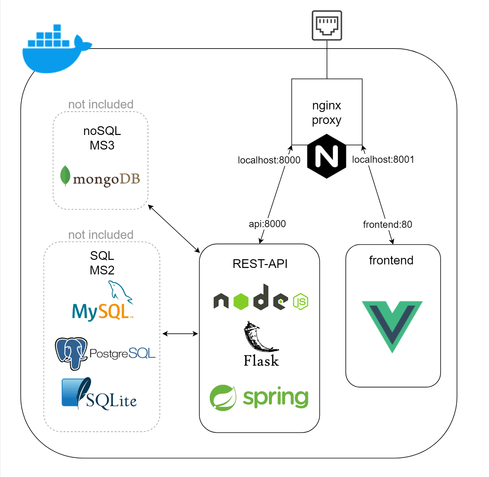
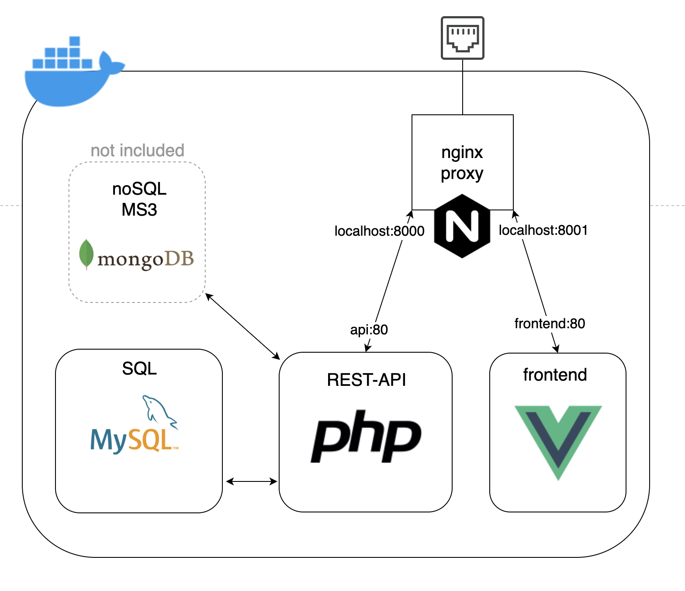
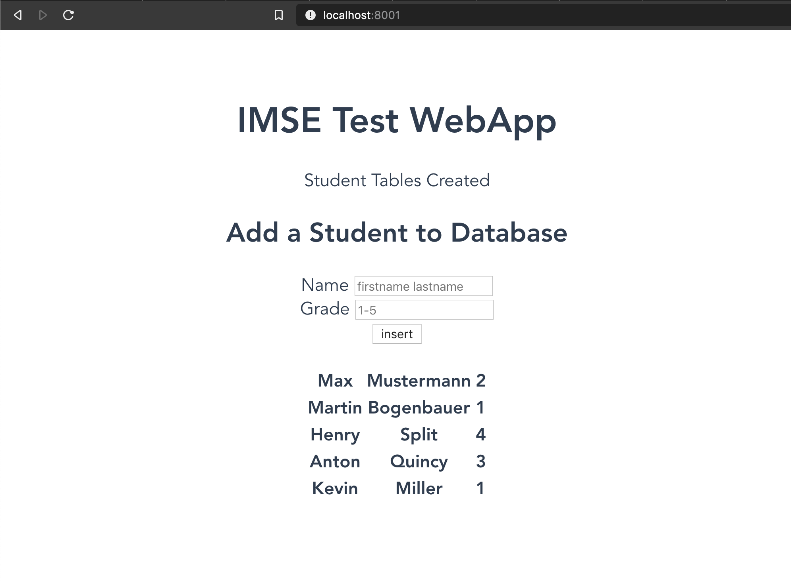

# How to run:

1. install Docker, run the Docker Daemon, make sure you are logged in with your Docker-ID and that Docker is running properly.
Check the [FAQ's](https://cewebs.cs.univie.ac.at/imse/ss20/index.php?m=F&t=info&c=afile&CEWebS_what=Info&CEWebS_rev=26&CEWebS_file=IMSE~32~Docker~32~FAQ%27s~32~SS2020.pdf) on the CeWebs Info page I've made to see how to install Docker.
2. clone this repo and navigate into any one of the projects.
3. run command:

```
docker-compose up --build
```
"Compose" is a tool for defining and running multi-container Docker applications.

It will run the services defined in docker-compose.yml in an isolated environment.

"up" starts and runs your entire app.

"--build" tells Docker it first has to build the images from your application. The instructions how to build the image are located in the Dockerfile's inside their respective folders.

This is also how your project should be run when you submit it!

4. navigate to:
```
localhost:8001
```
in your browser and click the button.

5. To stop the running containers simply "CTRL-C" and run:
```
docker-compose down
```
to tell Docker to remove the containers we've created in #3 that are defined in docker-compose.yml.

# Model for flask, node and spring




# Model for php-apache





